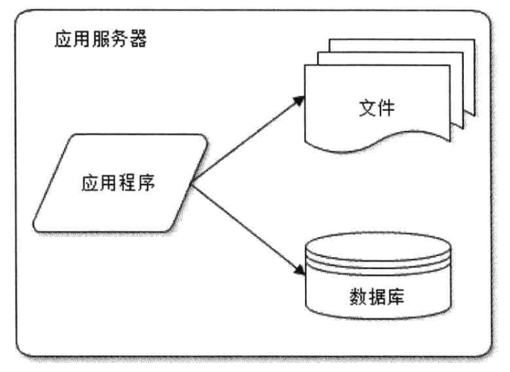
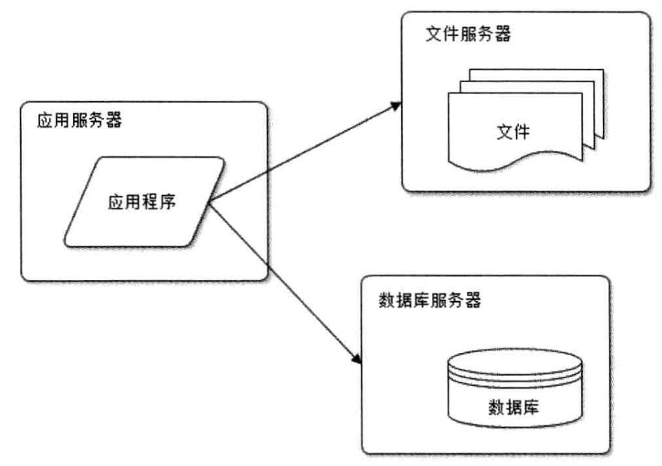
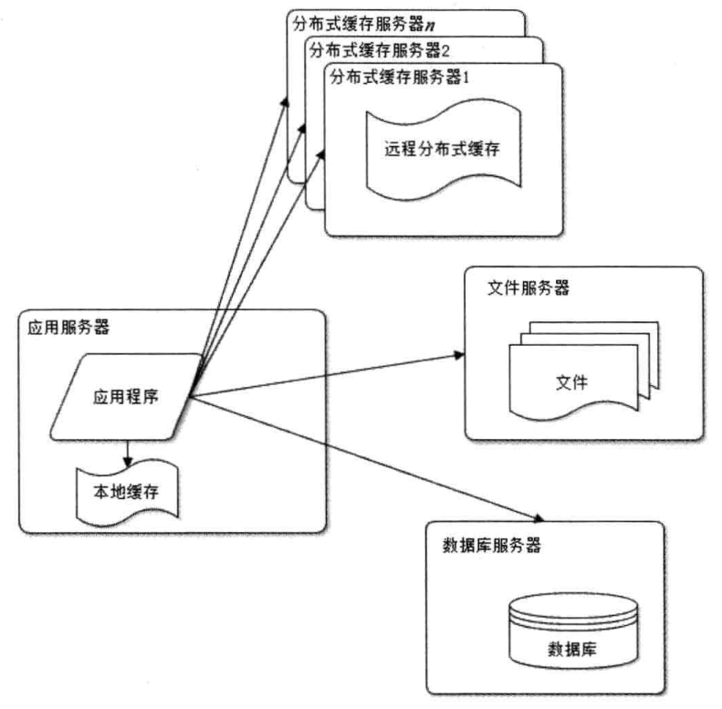
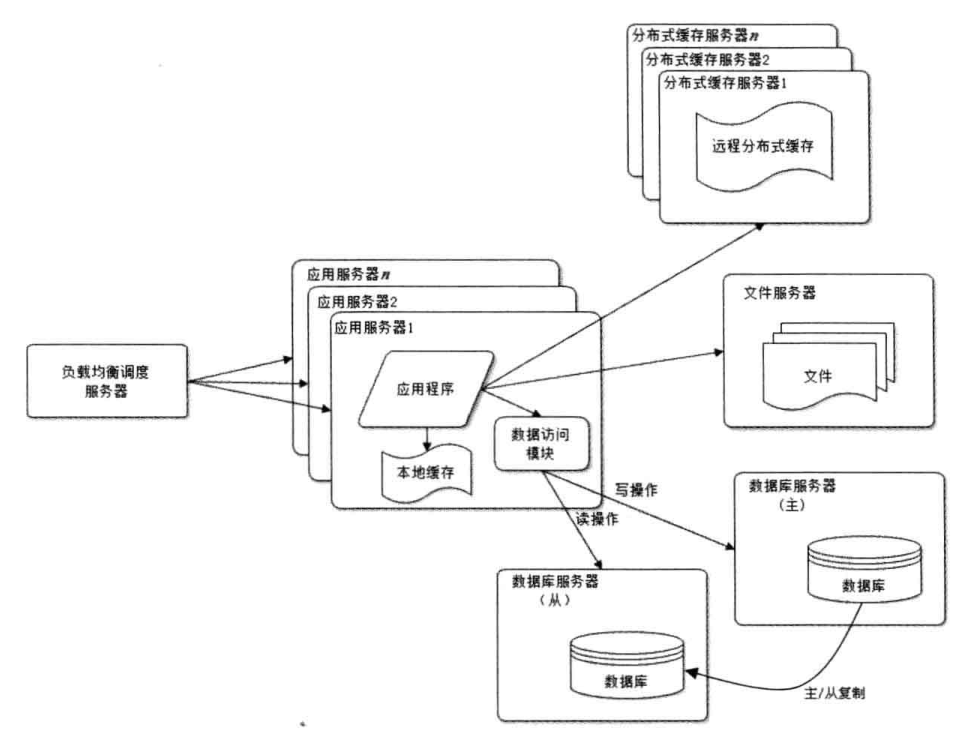
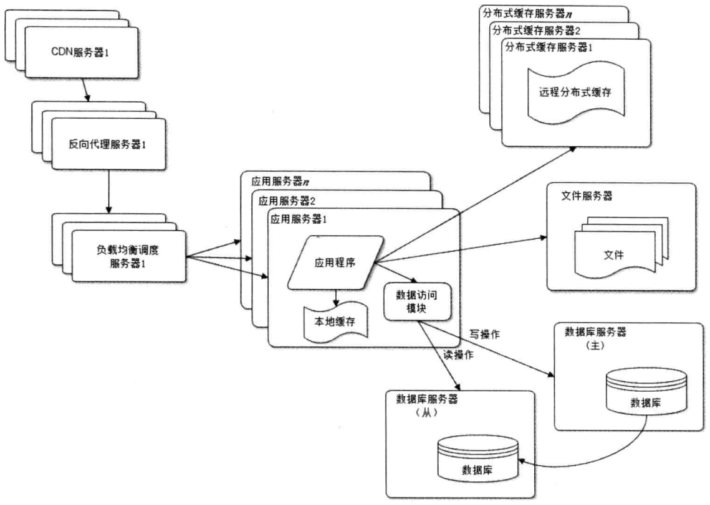
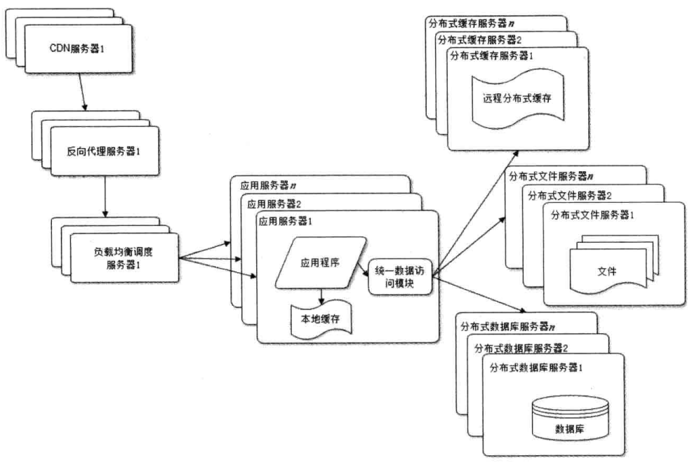
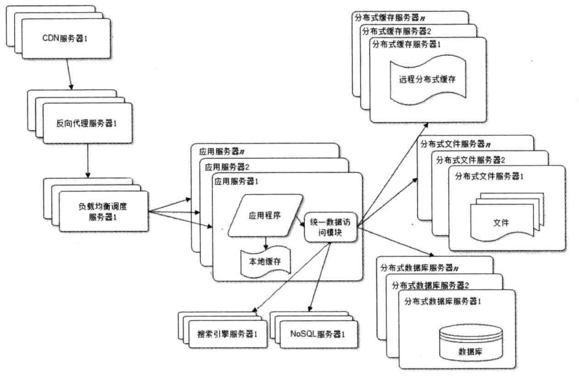
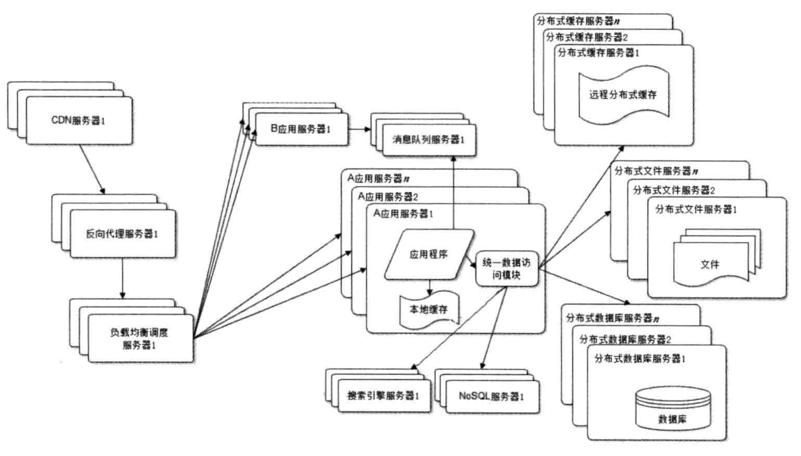
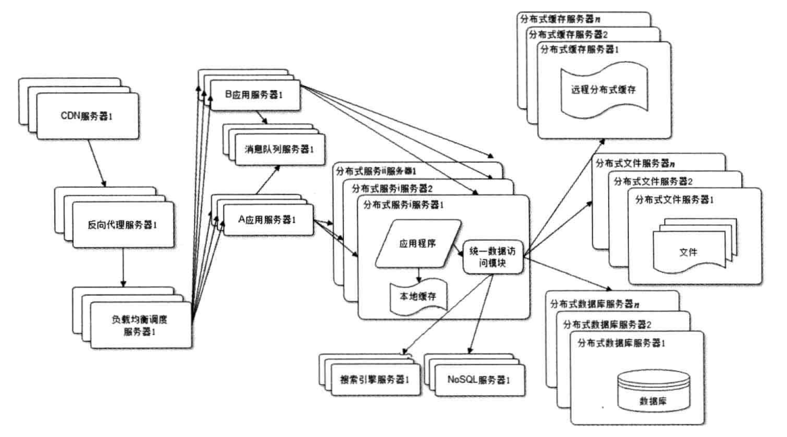

# 大型网站架构演化

### 大型软件系统的特点

- 高并发；大流量；高可用；海量数据；用户分布广泛，网络情况复杂；安全环境恶劣；需求快速变更，发布频繁；渐进式发展。

### 大型网站演化发展历程

##### 初始阶段的网站架构

- 小型网站最开始没有太多人访问，只需要一台服务器就可以了，架构如图所示。

##### 应用服务和数据服务分离

- 随着网站业务发展，一台服务器逐渐不能满足需求：越来越多的用户访问导致性能越来越差，越来越多的数据导致存储空间不足。
- 这时需要将应用和数据分离，分离后我那个站使用三台服务器：应用服务器、文件服务器和数据库服务器。

##### 使用缓存改善网站性能

- 随着用户逐渐增多，数据库压力太多导致访问延迟，进而影响整个网站的性能，用户体验受到了影响。
- 网站访问特点和现实世界的财富分配一样遵循二八定律：80%的业务访问集中在20%的数据上。
- 把这一小部分数据缓存在内存中，可以减少数据库的访问压力，提供整个网站的数据库访问速度，改善数据库的写入性能。
- 网站使用的缓存可以分为两种：
  1. 缓存在应用服务器上的本地缓存。
     - 本地缓存的访问速度更快一些，但是受应用服务器内存的限制，其缓存数据量有限，而且会出现和应用程序征用内存的情况。
  2. 缓存在专门的分布式缓存服务器上的远程缓存。
     - 远程分布式缓存可以使用集群的方式，部署大内存的服务器作为专门的缓存服务器，可以在理论上做到不受内存容量限制的缓存服务。

##### 使用应用服务器集群改善网站的并发处理能力

- 单一应用服务器能够处理的请求连接有限，在网站访问高峰期，应用服务器成为整个网站的瓶颈。
- 使用集群是网站解决高并发、海量数据问题的常用手段。

- 通过负载均衡调度服务器，可将来自用户浏览器的访问请求分发到应用服务器集群中的任何一台服务器上，如果有更多的用户，就在集群中加入更多的应用服务器，使应用服务器的负载压力不再成为整个网站的瓶颈。

##### 数据库读写分离

- 使用缓存后，绝大部分数据读写操作可以不通过数据库就能完成，但是仍有一部分读操作和全部写操作需要访问数据库，在网站达到一定规模后，数据库因为负载压力过高成为了网站的瓶颈。
- 通过数据库提供的主从热备功能，配置两台数据库主从关系，可以将一台数据库服务器的数据更新同步到另一台服务器上，从而实现数据库读写分离，改善数据库负载压力。

- 主数据库负责写操作，并通过主从复制机制将数据更新同步到从数据库，从数据负责读操作。

##### 使用反向代理和CDN加速网站响应

- 由于中国复杂的网络环境，不同地区的用户访问网站时，速度差别也极大，网站需要加速网站访问速度，主要手段有使用CDN和反向代理。
- CDN和反向代理的基本原理都是缓存，区别在于CDN部署在网络提供的机房，使用户在请求网站服务时。可以从距离自己最近的网络提供商机房获取数据；
- 而反向代理则部署在网站的中心机房，当用户请求到达中心机房后，首先访问的服务器是反向代理服务器，如果反向代理服务器中缓存着用户请求的资源，就将其直接返回给用户。

##### 使用分布式文件系统和分布式数据库系统

- 任何强大的单一服务器都满足不了大型网站持续增长的业务需求，数据库系统和文件系统需要使用分布式系统。
- 分布式数据库是网站数据库拆分的最后手段，只有在单表数据规模非常庞大的时候才使用，不到不得已时，网站更常用的数据库拆分手段是业务分库，将不同业务的数据部署在不同的物理服务器上。

##### 使用NoSQL和搜索引擎

- 随着网站业务越来越复杂，对数据存储和检索的需求也越来越复杂，网站需要采用一些非关系数据库技术如NoSQL和非数据库查询技术如搜索引擎。

##### 业务拆分

- 为了应对日益复杂的业务场景，通过使用分而治之的手段将整个网站业务分成不同的产品线，如大型购物交易网站就会将首页、商铺、订单、买家、卖家等拆分成不同的产品线，分归不同的业务团队复负责。
- 会根据产品线划分，将一个网站拆分成许多不同的应用，每个应用独立部署维护。应用间可以通过一个超连接建立关系，或者通过消息队列进行数据分发，最多的还是通过访问同一个数据存储系统来构成一个关联的完整系统。

##### 分布式服务

- 既然每一个应用系统都需要执行许多相同的业务操作，比如用户管理、商品管理等，那么可以将这些共用的业务提取出来，独立部署。
- 由这些可复用的业务连接数据库，提供共用业务服务，而应用系统只需要管理用户界面，通过分布式服务调用共同业务服务完成具体业务操作。

